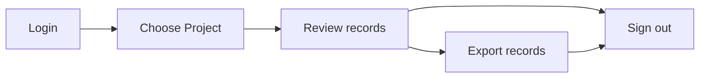

# OGRRE Guide

## Terminology

<dl>
<dt>Project</dt><dd>Shared workspace for working on records</dd>
<dt>Document Type</dt><dd>Grouping of similar documents, e.g., "well completion report"</dd>
<dt>Digitize</dt><dd>Intelligently convert an image to corresponding text values</dd>
<dt>Processor</dt><dd>External tool that reads digitizes the supported types of scanned document images </dd>
<dt>Record</dt><dd>An uploaded document digitized by the processor</dd>
<dt>Attribute</dt><dd>One digitized name and value from the document</dd>
<dt>Confidence</dt><dd>The degree of certainty the tool (or human, if set manually) has in the predicted digitized field values</dd>
</dl>

##  Workflow

### Overview

### Login

### Choose a project

### Review records

### Export records

### Sign out