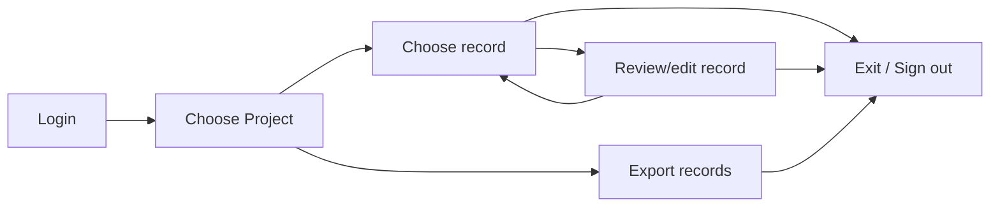

import {ProjectExportImg, ProjectListImg, ProjectReportsImg, ProjectReviewImg, ProjectViewImg} from "./screenshots.jsx";

# OGRRE Usage Guide

OGRRE is a web-based graphical user interface.
It should function well in any modern web browser.

:::note

This guide describes how to use the web interface to review and edit
values provided by a *processor* (see Terminology, below) for a set
of documents. It is assumed that the document [processing](docai) has 
already occurred, and the combination of scanned images and extracted
data have been uploaded into OGRRE -- all these steps are not
part of the OGRRE tool itself, and are currently performed by the
CATALOG team (see [Introduction](intro.md)). For an overview of that
process, see the [DocAI Processors](docai) page.
of documents. It is assumed that the document [processing](docai) has 
already occurred, and the combination of scanned images and extracted
data have been uploaded into OGRRE -- all these steps are not
part of the OGRRE tool itself, and are currently performed by the
CATALOG team (see [Introduction](intro.md)). For an overview of that
process, see the [DocAI Processors](docai) page.

:::

## Overview

Below is a summary of the basic workflow for using OGRRE.

## Terminology

Below are the terms used in the tool and throughout this guide.

|Term|Definition|
|----|----------|
|Project|Shared workspace for working on records|
|Document Type|Grouping of similar documents, e.g., "well completion report"|
|Digitize|Intelligently convert an image to corresponding text values|
|Processor|External tool that reads digitizes the supported types of scanned document images |
|Record|An uploaded document digitized by the processor|
|Attribute|One digitized name and value from the document|
|Confidence|The degree of certainty the tool (or human, if set manually) has in the predicted digitized attribute values|

## Login

Navigate to the URL of the OGRRE deployment you are using, then
login using your Google credentials.
You will need to have been added by an administrator as a valid user of this deployed instance.

## Choose a project

Records are organized into projects.
Start by selecting the project in the list.

<ProjectListImg />

This will open the **project view**, showing all the records in the project.

<ProjectViewImg />

The meaning of the columns in this view are as follows:

|Column|Description|
|------|-----------|
|Record Name|Name of file uploaded|
|Date Uploaded|When the file was uploaded|
|API Number|Well API Number available from the uploaded file|
|Confidence|For each attribute digitized, the associated confidence % given by processor|
|Mean Confidence|Mean of all digitized attributes’ confidence values in that record|
|Lowest Confidence|Lowest of all the confidence values in the record|
|Notes|Notes added to the record|
|Digitization Status|Status of record in tool: uploading/ processing/ digitized|
|Review Status|Status of review for the record: unreviewed/ reviewed|

## Choose a record

Selecting a record from the project (row in the table) to review will open the **record details view**,
which allows review and editing of a single record.

## Review/edit record

Below is an example digitized record on the record details view page.

<ProjectReviewImg />

### Layout

  - The digitized values are on the left scrollable section and the uploaded document is on the right.
  - The two sides are linked: selecting attributes on the left will highlight the place where it came from in the document on the right

### Contents

The meaning of the columns in the table on the left-hand side are as follows:

|Column|Description|
|------|-----------|
|Attribute|Name of the attribute in the database (and exported data)|
|Value|Digitized value detected for this attribute|
|Confidence|Confidence assigned by the processor. Some attributes with values may have low confidence. Values not found will have 0 confidence.|

### Actions

* Selecting a row in the table will highlight that attribute value in the image on the right panel.
* Clicking on a value will let you edit the value.
* You can edit and correct any wrong values detected by processor, or add values for attributes not detected.
* Complex tabular attributes are collapsed by default, and expand on clicking the row
* For each record, you could add notes by clicking ‘Notes’ button in the toolbar at the bottom and saving them. You could revisit the notes by clicking on same button again for the record. These notes are also accessible from Records list view.

Keyboard shortcuts:
|Windows Key|Mac Key|Action|
|-----------|-------|------|
|Up arrow|Up arrow|Previous row in table|
|Down arrow|Down arrow|Next row in table|
|Enter|Enter|Edit the value of highlighted attribute, or while editing to save|
|Esc|Esc|While editing, do not save the edited value|
|Ctrl + Shift + Right arrow|Cmd + Shift + Right arrow|Mark as reviewed & Go to next record|
|Ctrl + Left arrow|Cmd + Left arrow|Go to previous record|
|Ctrl + Right arrow|Cmd + Right arrow|Go to next record|

### Review status

A record can be in one of the following review statuses:

* Unreviewed
* Incomplete
* Reviewed
* Defective

## Export records

You can export all the record data in a project with the `Export Project` button
on the **project view** page.

<ProjectExportImg />

You can select attributes to include in the exported data.

The *CSV* option will export the values from each record as a comma-separated values table, whereas
the *JSON* option will export the values along with additional metadata about confidence
as a JSON (JavaScript Object Notation) object. Either of these formats can be read easily
using Python, and of course CSV is easily imported in Excel, Google Sheets, etc.

## Exit / Sign out

To logout you can close the window. Since the program uses Google credentials, if you 
sign out of your Google account you will need to login again on the next visit.
