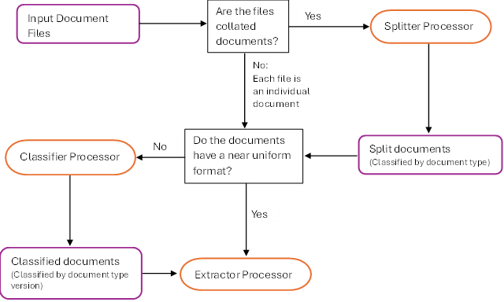

# Google Document AI Workflow

The first step of the OGRRE Workflow involves identifying how the
documents of the Input Document Files are stored. This includes
determining what the file format is, how many documents are in each
file, how many types of documents, and how many variations of each
document type.

Because the OGRRE Workflow relies on Google Document Ai the Input
Document File will need to be in one of the file formats supported by
Google Document AI Extractor Processors which are JPEG, JPG, PNG, BMP,
PDF, TIFF, TIF, and GIF additionally to ensure the best accuracy of the
extracted text, Extractor Processor's OCR component Google recommends,
"document scans should be a minimum of 200 dpi (dots per inch). 300 dpi
and higher," since the OCR accuracy is affected by the resolution, font
size, text readability, and image quality. https://cloud.google.com/document-ai/docs/file-types

If the Input Document Files are collated (multiple documents within each
file), a Splitter Processor is used to identify the boundaries between
documents and when the collated document files also contain multiple
document types the Splitter Processor is used to simultaneously classify
the split documents by document type.

If the Uncollated Input Document Files include multiple document types
and/or large variation between versions of a document type, a Classifier
Processor is used to classify each document into versions of a document
type. For Split documents that are already classified into document
types, for each document type that have large variation between
versions, a Classifier Processor is used to classify the document type
into versions of that document type.

Finally for each document type version in the Input Document Files a
unique Extractor Processor is used to extract the text from the
document.

# Input Document Files

When using the Google Document AI User Interface, the Input Document
Files can be imported to a processor in bulk from the Google Cloud
Storage Buckets or individually from Local Storage.

The location within the different processor types for importing document
files varies and will be identified in the sections relating to each
processor type.
