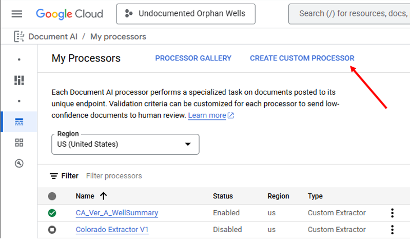

# Document AI

https://cloud.google.com/document-ai/docs/processors-list

https://cloud.google.com/document-ai/docs/create-dataset

https://cloud.google.com/document-ai/docs/label-documents

https://cloud.google.com/document-ai/docs/training-overview

Access Document AI from
https://console.cloud.google.com/ai/document-ai

When first starting it is suggested to pin Document Ai in the Navigation
Menu, this can be done by moving the cursor to the left sidebar to open
it and clicking the pin next to the header "Document AI"

Creating new processors can be performed from the Overview page or the
My Processors page by clicking "Create Custom Processor"

The Custom Processors page is used to create the Splitter, Classifier,
and Extractor Processors of the OGRRE Workflow. Clicking on "Create
Processor" will open a right side panel used to name the new processor
(Cannot be changed later), When "Create" is pressed the new processor is
created and opened.

