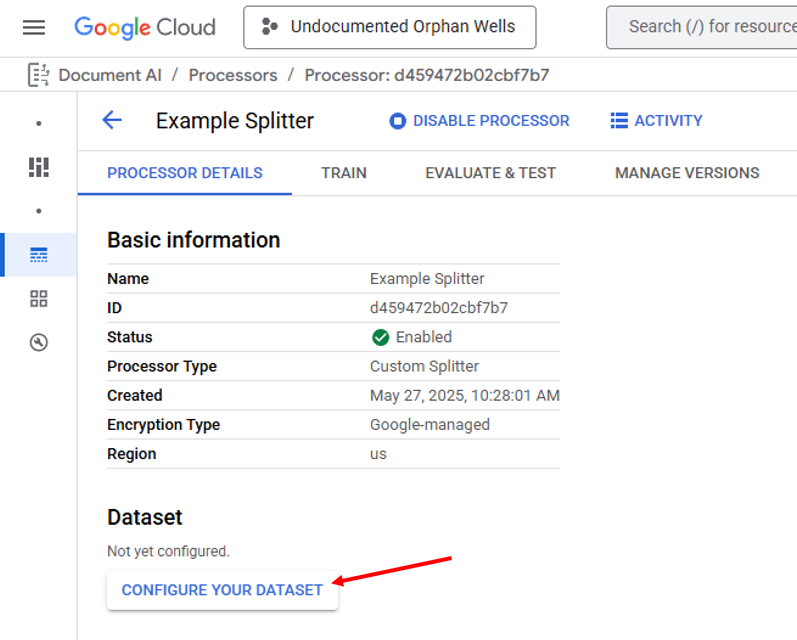
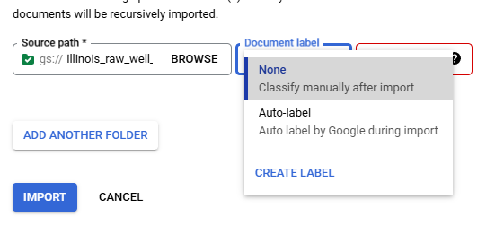
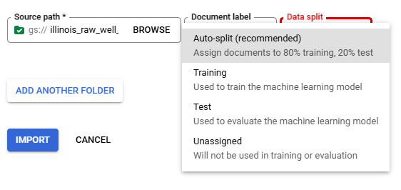
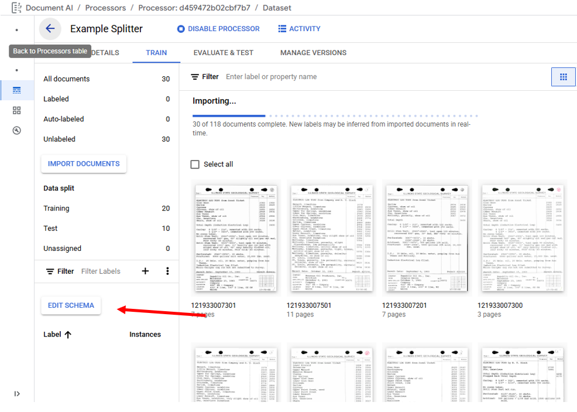
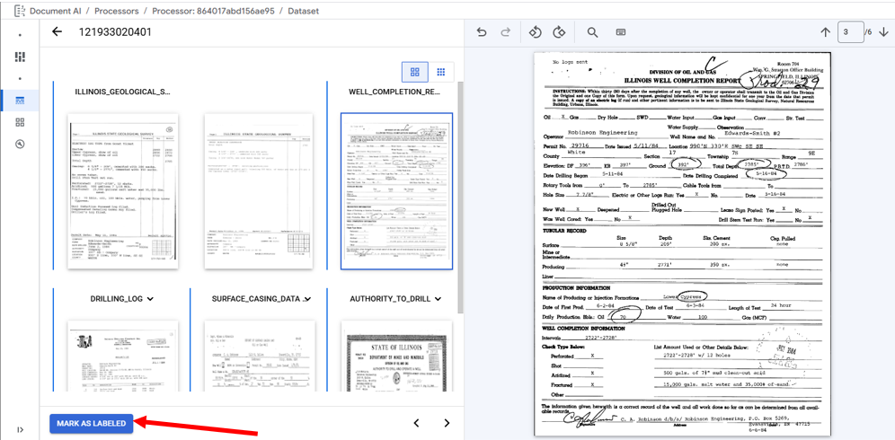
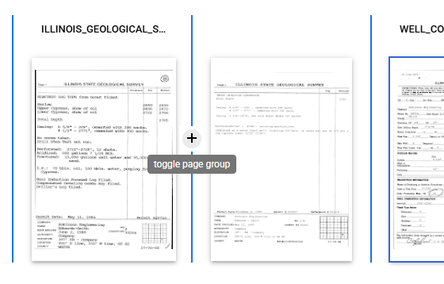
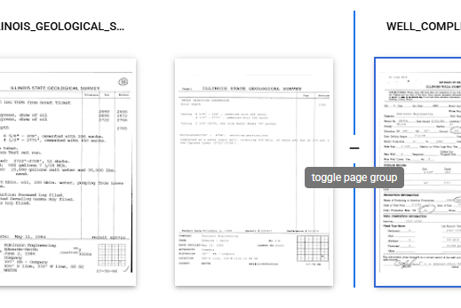
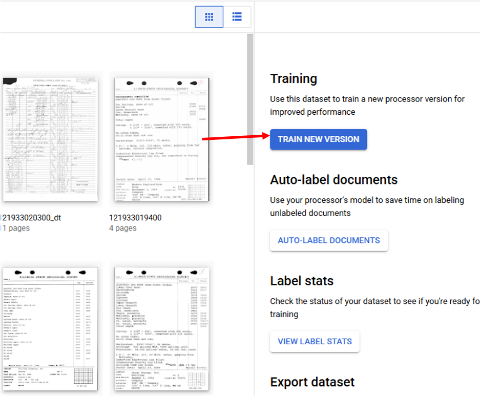
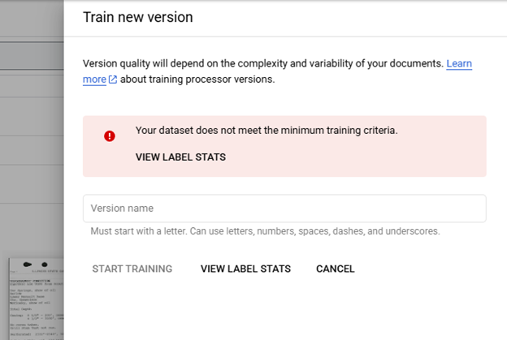

## Splitter

https://cloud.google.com/document-ai/docs/processors-list#processor_CUSTOM_SPLITTING_PROCESSOR

In a new Splitter Processor, the first action is to click "Configure
Your Dataset", and then select the desired Storage Location.

Once the dataset is configured documents can be imported by clicking
"Import Documents." The button in the main window (Blue Arrow) is only
visible when not documents have been imported. The button on the left
side panel (Red Arrow) can be used to import additional documents at any
time.

### Importing Documents

When "Import Documents" is clicked a right side panel is opened and used
select the "Source Path", "Document label", and "Data split." "Source
Path" is used to navigate to the documents to be imported. "Document
label" is used to label the documents as they are imported, the default
is "None" requiring the user to manually label then documents after
importing, "Auto-Label" can be used if a processor model has already
been trained and will label the documents based on the model prediction,
"Create Label" allows for the creation of a new label in the processor's
Schema, and any labels already present in the Schema will also populate
the "Document label" list; selecting a Schema label will label all of
the imported documents with that label. "Data split" identifies which
Data split bin the imported documents will be placed in Training,
Testing, or Unassigned with the exception of Auto-split which places 80%
of the imported documents in the bin Training and 20% in the bin
Testing, the "Data split" selection will place all imported documents
into the selected bin.

### Schema Definition

The Splitter Processor Schema can be managed by clicking on "Edit
Schema" under the "Train" tab. The Edit Schema page is used to Create
Labels, Enable/Disable Labels, and Delete labels. When creating labels,
it is best practice to choose descriptive names, **note** label names
cannot be edited after document labeling has started. Deleting labels is
disabled after a processor model is trained.

### Labeling Documents

Accessing the Labeling Interface is done by double clicking on a
document in the main area of the Train tab

The Labeling Interface has the labeling area on the left and a single
page view on the right. Labeling for Splitter Processors involves
marking the boundaries (Blue Lines) between documents and selecting the
appropriate label (above first page of document grouping). Changing
boundaries is done by clicking between pages on the +/-. Changing the
document label is done by clicking the label and selecting from the
dropdown. When done labeling a file click "Mark as Labeled" to save
labels and progress to next labeling task.

### Training Models

Training models is performed from the Train tab by clicking on "Train
New Version" which opens a right side panel used to start training a
model. In order to train a model all enabled labels must meet the
minimum number of files with each label in the Training (10) and Testing
(2) bins. Clicking on View Label Stats shows the distribution of each
label. The labels that do not meet the requirements are listed at the
top and flagged with a warning. If a label is unimportant disabling the
label in the Schema will remove the label from the model training
requirements, this will not remove labels in the document files. When
the requirements are met a new model can be trained, it is suggested to
use sequential naming to differentiate between multiple iterations of
training.

### Model Selection

Models are managed from the Manage Versions tab, where models can be
Deployed/Undeployed, Deleted, evaluated, and a Default model can be
selected. A default model is not required to be selected for Splitter
Processors, default models cannot be Undeployed. For each model the
Version ID, creation timestamp, current deployment status, model name,
and last evaluation's F1 score are displayed. Models are automatically
evaluated as part of the training process new evaluations can be
triggered and are performed using the current active Schema and Labeled
Testing Documents. Additional evaluation details are viewed on the
Evaluate & Test tab where the F1 score for each label can be seen. F1
scores are the harmonic mean of precision and recall, which combines
precision and recall into a single metric, providing equal weight to
both, defined as

2 \* (Precision \* Recall) / (Precision + Recall)

producing a model accuracy value on a scale of 0 to 1 where a value of 1
indicates perfect model prediction for the Testing Documents.
(https://cloud.google.com/document-ai/docs/evaluate#all-labels) Due to
the importance of matching Extractor Processors to Document Versions in
the OGRRE Workflow, before being included in the workflow Splitter
Processor Model is expected to meet the minimum F1 score of 0.950 when
the Testing dataset includes at least 100 documents.

