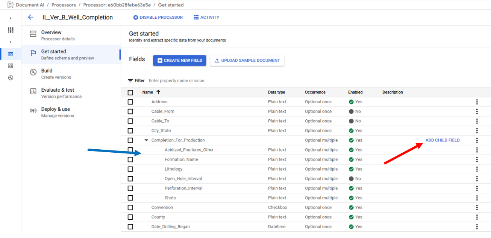
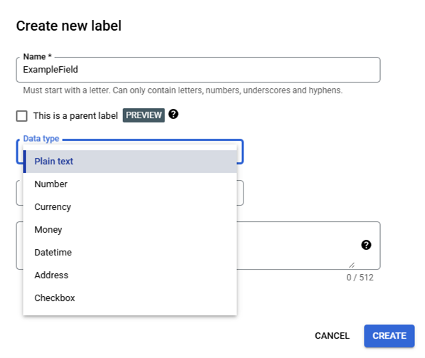

## Schema Definition

The Extractor Processor Schema is managed on the "Get started" page, and
is used to Create Labels, Enable/Disable Labels, Delete Labels, and Edit
Labels. When creating labels, it is best practice to choose descriptive
names. **Note** Label Names cannot be edited after document labeling has
started, and the Deleting and Editing of a Label is disabled after it is
included in a trained processor model, with the exception Editing a
Label's Description is always enabled.

To create a label, click on "Create New Field" this will open the
"Create new label" popup in the middle of the page for setting the Label
Name, Parent Label Attribute, Data Type, Occurrence, and an optional
Description.

The Label Name is used by the models to form the underlying prompt, so
the field names are semantically critical, it is recommended to match
the name of the field on the documents for example for the document
field "Signature of Permittee or Designee" the field Label Name would be
"signature_of_permittee_or_designee."
(https://cloud.google.com/document-ai/docs/ce-mechanisms#define_processor_fields,
https://cloud.google.com/document-ai/docs/label-documents#name-fields)
The Parent Label checkbox toggles between whether the new field will be
normal single label or will be a parent label that is a container for
single labels that need to be associate, this is ideal for extracting
data from tables. Fields are added to a Parent Field from the "Get
started" page by clicking on "Add Child Field" (Red Arrow) which will
also open the "Create new label" popup in the middle of the page. Child
Fields will appear below the Parent Field with their Label Names
indented (Blue Arrow). The Google interface currently permits nesting
one additional Parent Field as a Child Field, but this functionality is
not currently supported in the OGRRE Tool.

The Data Type which only applies to single labels has the options Plain
Text, Number, Currency, Money, Datetime, Address, and Checkbox. The data
types: Number, Currency, Money, and Datetime come with an additional
feature called Normalization intended to reduce post-processing needs by
cleaning the extracted text values and converting them into a standard
format. https://cloud.google.com/document-ai/docs/normalization The
OGRRE Workflow includes additional post-process cleaning functionality.

The Occurrence has the options Optional Once, Optional Multiple,
Required Once, and Required Multiple. The OGRRE Workflow only uses
Optional Once or Optional Multiple since any document that the Extractor
Processor's OCR component fails to detect text for a Required Occurrence
Field results in the exclusion of the document from Model Training; the
effects of Required Occurrence Fields on document processing were not
tested by the OGRRE Team. The Optional Once Occurrence is used for
fields expected to only have up to one entry on each document for fields
that may have more than one entry on a document the Occurrence Optional
Multiple is used.

The optional Description attribute for a field is used by the models to
form the underlying prompt allowing to provide additional context,
insights, and prior knowledge for each entity to improve extraction
accuracy and performance; Google recommends that Descriptions should
include location information and text patters of the property values to
help disambiguate potential sources of confusion in the document and
guiding the model with rules that ensure more reliable, consistent
extractions, regardless of the specific document structure or content
variations.
(https://cloud.google.com/document-ai/docs/ce-mechanisms#define_processor_fields)
The OGRRE Team has not tested the use of the Description attribute.

