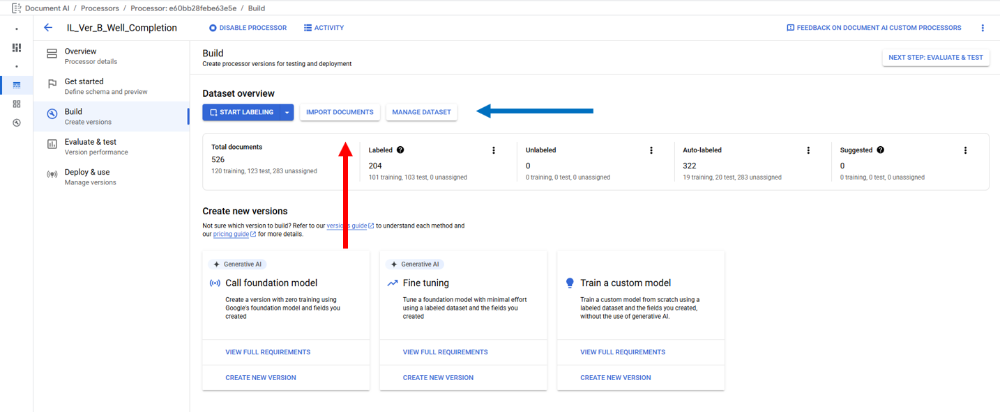
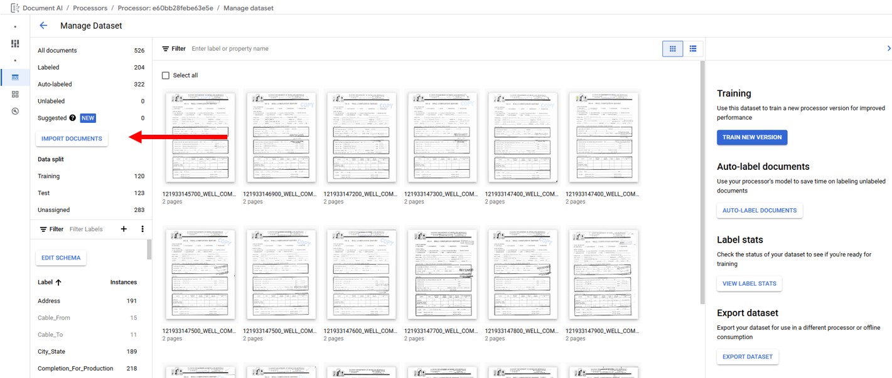
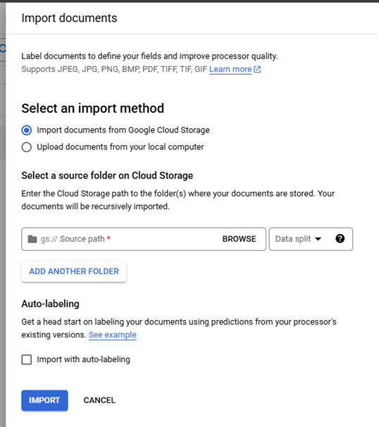
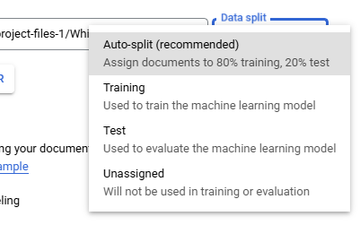

## Importing Documents

In an Extractor Processor Importing Documents is primarily performed on
the "Build" tab or "Manage Dataset" page by clicking on "Import
Documents" (Red Arrows). The "Manage Dataset" page is accessed from the
"Build" tab by clicking on "Manage Dataset" (Blue Arrow).

When "Import Documents" is clicked a right side panel is opened and used
select the "Source Path", "Data Split", and "Auto-labeling." "Source
Path" is used to navigate to the documents to be imported. "Data split"
identifies which Data split bin the imported documents will be placed in
Training, Testing, or Unassigned with the exception of Auto-split which
places 80% of the imported documents in the bin Training and 20% in the
bin Testing, the "Data split" selection will place all imported
documents into the selected bin. The "Auto-labeling" checkbox when
selected will the "Versions" dropdown that will display active processor
models that can be used to auto-label fields within the documents.
"Auto-labeling" can also be performed on previously imported Unlabeled
and Auto-Labeled documents from the "Manage Dataset" page by clicking on
"Auto-Label Documents" (Red Arrow)

