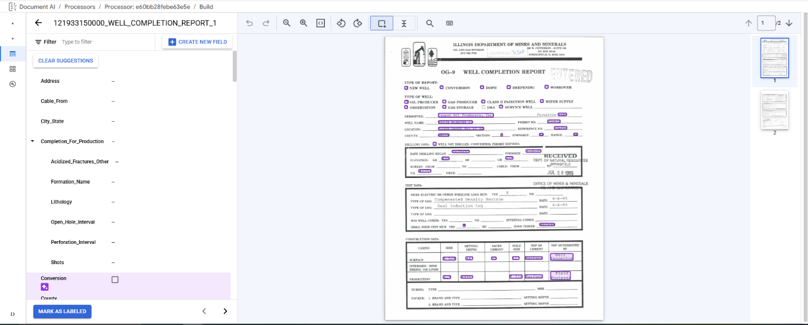

## Labeling Interface

Accessing the Extractor Processor Labeling Interface can be done from
either the "Build" tab by clicking on "Start Labeling" (Red Arrow) or
the "Manage Dataset" page by double clicking on a document in the main
area (Red Boundary).

The Labeling Interface has the Labels and Actions on the left, Labeling
Environment in the middle, and the Page Selector on the right.

The Labels and Actions Area contains the alphabetical list of Labels,
defined in the schema, the available Actions for a Label are displayed
by mousing over the Label with the cursor at the same time if the Label
is associated with a label a small pop up will display in the Labeling
Environment Area next to the Label Bounding Box. Labels can be either of
type Field Label or Table Label. Field Labels are the standard type of
Label associating one set of data to one Field. Table Labels are
containers for "Child" Field Labels that allows for associating sets of
data entries occurring in separate Fields. Labels may also be Unlabeled,
Suggested, or Confirmed/User Defined each of these has a different set
of available Actions depending on if it is a Field Label or Table Label.
