## Labels & Actions Area

###### Field and Table Labels

####### **Unlabeled Field Labels** 

Display the Field Name, a double dash "\--" for the Field Value, the
Annotate button (a square with a plus sign in the bottom right corner),
and the Add Instance button (the left and bottom sides of a square on
the lower right side of a square with a plus sign in the middle).

####### **Suggested Field Labels**

The Suggested Field Labels are highlighted in purple and display a dark
purple square containing two 4-pointed stars below the Field Name.
Following the Field Name is the Field Value which for Field with Data
Type Checkbox will display either a checked checkbox (a blue square with
a checkmark) or an empty checkbox (a grey sided square); for other Data
Type Fields the Field Value will show the predicted text. If the
predicted text was also normalized the Normalized Field Value is
displayed below the Field Value next to the Google **G**. The Action
buttons of Suggested Field Labels are the Confirm button (a circle with
a checkmark inside), the Edit button (a pencil symbol), the Add Instance
button (the left and bottom sides of a square on the lower right side of
a square with a plus sign in the middle), and the Delete Button (a trash
can symbol).

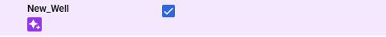

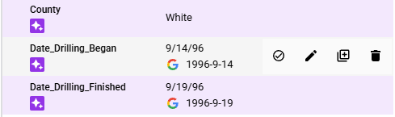

####### **Confirmed/User Defined Field Labels** 

The Field Labels that were Suggested Field Labels that have been
confirmed will display an outline of a person with a checkmark below the
Field Name otherwise the Field Label was User Defined. Following the
Field Name is the Field Value which for Field with Data Type Checkbox
will display either a checked checkbox (a blue square with a checkmark)
or an empty checkbox (a grey sided square); for other Data Type Fields
the Field Value will show the predicted text. If the predicted text was
also normalized the Normalized Field Value is displayed below the Field
Value next to the Google **G**. The Action buttons of Field Labels are
the Edit button (a pencil symbol), the Add Instance button (the left and
bottom sides of a square on the lower right side of a square with a plus
sign in the middle), and the Delete button (a trash can symbol).

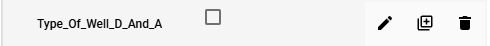

####### **Table Labels without Labeled Child Field Labels**

Display the Table Name, a double dash "\--" for the Field Value, and the
Add Instance button (the left and bottom sides of a square on the lower
right side of a square with a plus sign in the middle). Followed below
by the indented "Child" Field Labels.

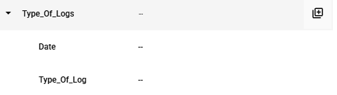

####### **Table Labels with Suggested/Confirmed/User Defined Child Field Labels**

Display the Table Name, a tuple of the "Child" Field Label Field Values,
the Add More Rows button (the symbol of a data table with a 4-pointed
star in the top right corner), the Add Instance button (the left and
bottom sides of a square on the lower right side of a square with a plus
sign in the middle), and the Delete button (a trash can symbol).
Followed below by the indented "Child" Field Labels.

###### **Action Buttons**

####### **Add Instance**

The Add Instance button is used to add an additional instance of the
specified Label. The new instance will appear below the current Label.

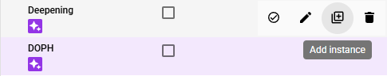

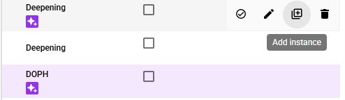

####### **Add More Rows** 

The Add More Rows button is used to quickly label the remaining rows of
a table based on the position of the labeled "Child" Field Labels in the
Table Label. When Add More Rows is in use the Table Label boundary will
switch from blue to a dashed purple, and within the Labeling Bounding
Box the identified new "Child" Field Labels will be included within
their own Bounding Boxes, Table Label Bounding Boxes will not be shown
during the Labeling step. Any number of additional rows can be added at
a time and the new Table Labels will be added as collapsed Table Labels
below the initial Table Label. Table Labels and "Child" Field Labels
added with this tool should be immediately verified because mixing rows,
column and/or including extra words regularly occurs.

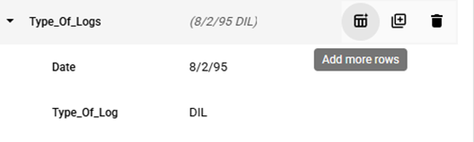

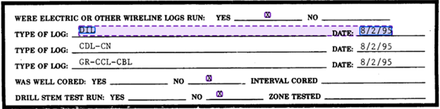

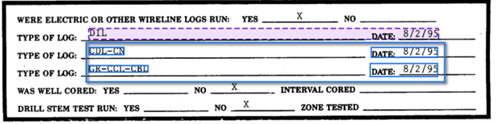

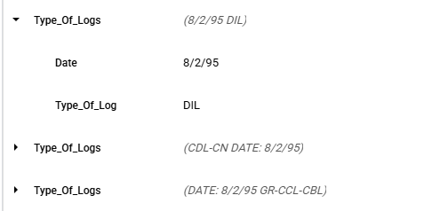

######## Expanded

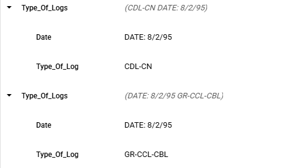

####### **Annotate**

The Annotate button selects the Unlabeled Field Label so that the next
drawn Bounding Box or Selected Text will be associated with the Field
Label.

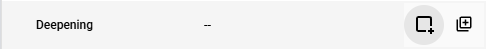

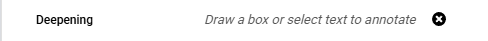

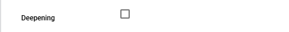

####### **Confirm** 

The Confirm button is only present for Suggested Labels and is used to
confirm the Bounding Box position of the Suggested Label and converts it
to a Confirmed Label.

######## Suggested Label

######## Confirmed Label

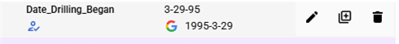

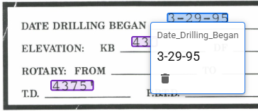

####### **Delete**

The Delete button is used to either remove additional instances of a
Label or reset the last instance of a Label to the Unlabeled status.

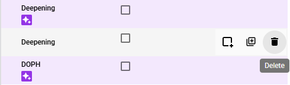

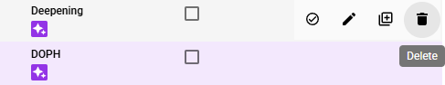

####### **Edit**

The Edit button opens the Field Editing Interface which allows the user
to change the Field of the Label, change the Value, and Move or Resize
the Bound Box. **Note: MANUALLY EDITING VALUE WILL NEGATIVELY IMPACT
MODEL TRAINING!** Remember the Value must match the Extracted Value.

######## Change Field of Label

To change the Field of the Label, click on the "Label \*" box to open a
dropdown of available Schema Fields to select from, the change will not
be reflected until the Confirm button is clicked.

######## Change the Value of a Label

To change the Value of the Label click cancel to undo any changes, the
Value **must** match the Extracted Value.

######## Move Bounding Box

To Move the Bounding Box position, click, hold, and drag the interior of
the Bounding Box to the desired position. **Note:** The Value is auto
updated with the OCR Extracted Value since the Value **must** match the
Extracted Value. When moving the Bounding Box any new Text that is
overlapped by the Bounding Box will get highlighted in blue and will be
included in auto updated Value.

######### Original Position

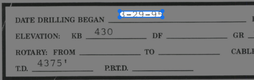

######### New Position

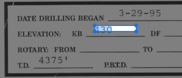

######## Resize Bounding Box

To Resize the Bounding Box position, click, hold, and drag one of the
four corners of the Bounding Box to the desired position. **Note:** The
Value is auto updated with the OCR Extracted Value since the Value
**must** match the Extracted Value. When resizing the Bounding Box any
new Text that is overlapped by the Bounding Box will get highlighted in
blue and will be included in auto updated Value.

######### Original Position

######### New Position

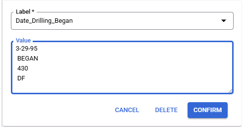

