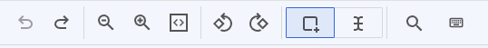
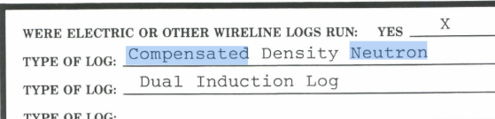
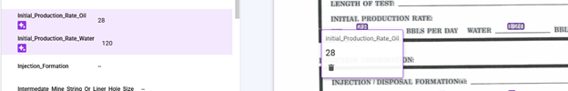
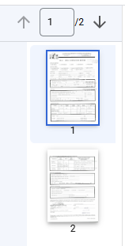
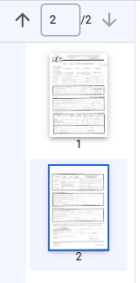
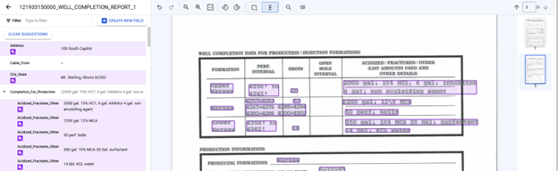
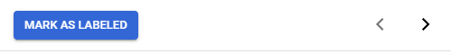

## Labeling Environment Area

At the top of the Labeling Environment area is a toolbar with the tools
(from left to right): Undo, Redo, Zoom Out, Zoom In, Zoom to Fit, Rotate
Left, Rotate Right, Add Bounding Box, Select Text, Search, and Keyboard
Shortcuts. The style of labeling is selected between either of tools Add
Bounding Box or Select Text. The OGRRE Team found that using the Select
Text Labeling Style for identifying Labelable Text (particularly
Checkbox Data Type Labels) and switching to the Add Bounding Box
Labeling Style to make a Label was often the fastest and easiest method.

###### Bounding Box Labeling Style

In the Add Bounding Box Labeling Style all Labeling is performed by
drawing bounding boxes over the text to be labeled; for the best results
the Bounding Box should tightly fit the bounds of the text. **Note:**
Any text that is identified by the OCR as part of the same word will be
included as part of the label will be highlighted in blue.

###### Select Text Labeling Style

In the Select Text Labeling Style all text identified by the OCR is
highlighted in grey, conveniently showing where a label cannot be added
because the text failed to be detected; Labeling is performed by
selecting text in a similar manner as for Text Editors except slight
variations in text height can put adjacent text on separate lines
allowing for some text to be unexpectedly skipped or included in the
Selected Text.

###### Change Field of Label

The Field of a Label can be changed from within the Labeling Environment
Area by mousing over the Bounding Box which will cause a Popup Box with
the Label information to be displayed. By clicking on the Field Name a
dropdown of the available Schema Labels is the used to select the
correct Field.

###### Delete Label

A Label can be deleted from within the Labeling Environment Area by
mousing over the Bounding Box which will cause a Popup Box with the
Label information to be displayed. By clicking on the trash can symbol
the Field Label associated with the Bounding Box will be deleted.

##### Page Selector Area

The Page Selector Area is used to switch between Pages of a Document by
clicking on the Up Arrow or Down Arrows, typing in a Page Number, or
clicking on the Page Image. When the Page is switched all three Labeling
Interface Areas are updated, the Labels and Actions Area will only
display Labels present on the Active Page, the Labeling Environment Area
will display the Active Page, and the Page Selector Area will show the
Active Page Number and Active Page Image will be highlighted with a blue
boarder.

##### **Switching Document**

At the bottom of the Labels and Action Area is shown the buttons used to
Switch between Documents with the "Mark as Labeled" button, the Left
Arrow, and Right Arrow. The "Mark as Labeled" button when will save all
annotations and advance to next document. The Left Arrow is used to
return to the previous Document and on the Right Arrow will advance to
next Document. **Note:** If any changes to the Labels have been made
both the Left Arrow and the Right Arrow will trigger a popup window in
the middle of the Labeling Environment Area asking to confirm, "Discard
unsaved changes?" before switching Documents.

