## Labeling

For Extractor Processors, when a Document is loaded into the Labeling
Interface to aid in the Labeling Process the Extractor Processor will
create Suggested Labels generated either during Auto-Labeling or from
the Schema Definitions along with previously Labeled Documents. These
Suggested Labels are regularly helpful for speeding up the Labeling
Process, unfortunately not all Fields will receive reliable Suggested
Labels and for Documents with complicated layouts or are poor-quality
the Suggested Labels frequently become unusable. As a result, a
significant portion of the Labeling Process involves reviewing and
relabeling Suggested Labels at the same time a creating Labels for
Unlabeled Fields. The primary aim of Labeling for an Extractor Processor
is to ensure the defined Bounding Box of each Label includes the
relevant Extracted Values that are generated by the OCR. **Note:** Every
Bounding Box is **required** to include OCR identified Text; any
Bounding Boxes without OCR identified Text will result in the entire
document getting excluded during the Model Training and Testing, an
Unlabeled Field is usually preferable.

Labeling is done by using the Bounding Box Labeling Style or the Select
Text Labeling Style. The OGRRE Team found that using the Select Text
Labeling Style for identifying Labelable Text (particularly Checkbox
Data Type Labels) and switching to the Add Bounding Box Labeling Style
to make a Label was often the fastest and easiest method.

While Labeling there are some common Label Errors that Labelers should
expect to see. These Label Errors will fall into either Unfixable Label
Errors that usually stem from the backend OCR component, and Fixable
Label Errors that usually stem from generation of Suggested Labels.
**Note:** Label Errors tend to be visually subtle and require Labelers
to maintain sufficient focus to detect them, and Labeling can be *very*
boring making the change of losing focus a near guarantee.

##### **Common Unfixable Label Errors**

###### Checkbox Value Error

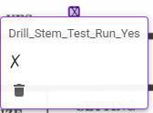

###### Extra Character Error

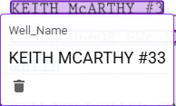

###### Wrong Character Error

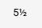

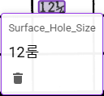

###### Combine "Word" Error

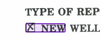

###### Failed Detection Error

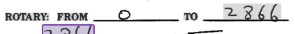

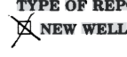

###### Hallucination Error

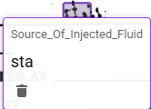

###### Department Stamps

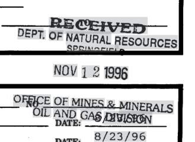

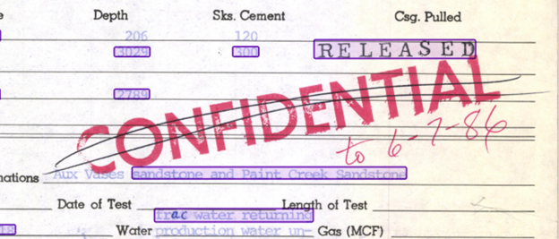

###### Poor Quality Scan

###### Field Abuse

##### **Common Fixable Label Errors**

###### Mismatched Field

Mismatched Fields are fixed by changing the Field of the Label through
either the Editing Interface or the Bounding Box Popup.

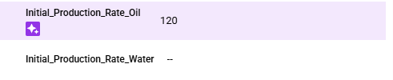

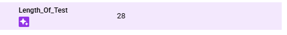

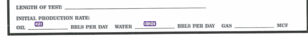

###### Overlapping Labels

Overlapping Labels are fixed by deleting Labels. Overlapping Labels are
also often paired with Mismatched Fields and will involve changing the
Field of the Label.

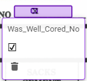

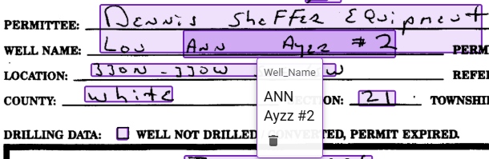

###### Multiple Table Rows in a Single Table Label Instance

Suggested Labels for Tables sometimes will capture multiple rows under a
single Table Label instance. Fixing this requires deleting the extra
rows and relabeling in new Table Label instance. Sometimes it may be
simpler to delete the entire suggested Table Label.

