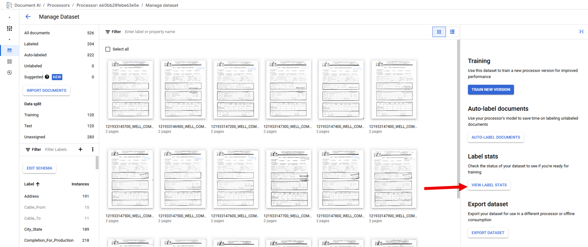

## Training Models

Extractor Processors have four types of models that can be trained that
fall under three categories found on the Build Tab below the Dataset
Overview under Create New Versions. The three categories are Call
Foundation Model, Fine Tuning, and Train a Custom Model. All three
categories can be accessed from the Build tab in the Create New Versions
section (Red Border) below the Dataset Overview section by clicking on
the category's "Create New Version" buttons (Blue Arrows). Additionally,
the Train a Custom Model category can be accessed from the Manage
Dataset Page by clicking on the "Train New Version" button (Red Arrow).
Each button will open a right side panel used to start training a model.
If a less important Label is preventing Model Training because it
doesn't meet the requirements it is recommended to disable the Label in
the Schema to remove the Label from the Model training requirements,
this will not remove Labels in the document files. When the requirements
are met a new Model can be trained, it is suggested to use sequential
naming to differentiate between multiple Model Training Phases.

In order to train a model all enabled Labels must meet the minimum
required number of Documents with each Label in the Training and Testing
Sets. Clicking on the "View Label Stats" button (Red Arrow) shows the
distribution of each Label.

The Field Labels and Table Labels that do not meet the requirements are
listed at the top of the Label List and flagged with a red warning.
Note: If a Table Label meets the requirements but one of its "Child"
Field Labels do not meet the requirements, the Table Label will be
listed in its alphabetical position in the Label List and the "Child"
Field Label will be listed at the "Child" Field Labels within the Table
Label and flagged with a red warning.

When all active Labels meet the requirement, but not all meet the
recommended number of Documents the message "Your dataset does not meet
the recommended training criteria. You can still train a new version,
but your model\'s quality may be affected." with an orange warning flag
will be shown above the Label List. If the recommended number of
Training Documents is not met an orange warning flag will be next to
"Each label exists on 50 training documents (minimum: 10)". If the
recommended number of Testing Documents is not met an orange warning
flag will be next to "Each label exists on 50 test documents (minimum:
10)".

#### Call Foundation Model

Call Foundation Model creates a Model from Google's Pretrained
Foundation Models with zero training using only the Schema for tuning
and has the requirement that at least one Field is defined in the
Schema. When creating a Foundation Model the Model's Base Version is
selected from a dropdown list of the available Pretrained Foundation
Models.

The OGRRE Workflow does not make use of Call Foundation Model.

#### Fine Tuning

Fine Tuning creates a Model from Google's Pretrained Foundation Models
by using the Labeled Documents and the Schema for tuning and recommends
that each Field is present in 50 Documents in the Training Set and 50
Documents in the Testing Set of the Labeled Documents while requiring
only that each Field is present on a minimum of 1 Document in each
Document Set. When creating a Fine Tuning Model the Model's Base Version
is selected from a dropdown list of the available Pretrained Foundation
Models. Fine Tuning has two Tuning Setting called Train Step and
Learning Rate Multiplier the OGRRE Workflow uses the default Tuning
Setting parameters.

#### Train a Custom Model

Train a Custom Model creates a Model *without* the use Google's
Pretrained Foundation Models relying only on the Labeled Documents and
the Schema to create the Model. Custom Models can be either Model Based
or Template Based selected with the radio buttons under "Model Training
Method".

##### Template Based

Template Based Custom Models require that each Field is present in 3
Documents in the Training Set and 3 Documents in the Testing Set of the
Labeled Documents.

The OGRRE Workflow does not make use of Template Based Custom Models
because of their inability to handle any variation.

##### Model Based

Model Based Custom Models recommend that each Field is present in 50
Documents in the Training Set and 50 Documents in the Testing Set of the
Labeled Documents while requiring that each Field is present in 10
Documents in the Training Set and 10 Documents in the Testing Set of the
Labeled Documents.

#### OGRRE Workflow

The OGRRE Workflow sets out that during each Model Training Phase a new
Fine Tuning Model is trained from each of the available versions of
Google's Pretrained Foundation Models along with one new Model Based
Custom Model. As a result, the OGRRE Workflow follows the requirements
set in place for training a Model Based Custom Model of a minimum of 10
Documents in the Training Set and 10 Documents in the Testing Set of the
Labeled Documents for each Field before training any Model. Prior to
initiating the Model Training Phase any Fields that do not meet the
minimum requirement are disabled.
