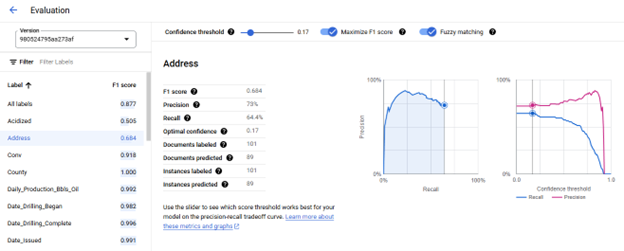

## Model Selection

#### Model Management

Models are managed from the Deploy & Use tab, where models can be
Deployed/Undeployed, Deleted, evaluated, and a Default model can be
selected. When an Extractor Processor is created a Default Model is
automatically selected from Google's Stable Pretrained Foundation
Models, any trained Model can be selected as the Default Model, Default
Models cannot be Undeployed. For each Model the Version ID, creation
timestamp, current deployment status, Model Name, and last evaluation's
F1 score are displayed. Models are automatically evaluated as part of
the Training Process. New evaluations can be triggered and are performed
using the current active Schema and Labeled Testing Documents.

The OGRRE Workflow, before being included in the workflow an Extractor
Processor Model is expected to meet the minimum F1 score of 0.800 when
the Testing dataset includes at least 20 documents or a minimum F1 score
of 0.900 when the Testing dataset includes at least 100 documents.

#### Model Evaluation

Additional evaluation details are viewed on the Evaluate & Test tab
where the F1 score for each Label can be seen. F1 scores are the
harmonic mean of precision and recall, which combines precision and
recall into a single metric, providing equal weight to both, defined as

2 \* (Precision \* Recall) / (Precision + Recall)

producing a model accuracy value on a scale of 0 to 1 where a value of 1
indicates perfect model prediction for the Testing Documents.
(https://cloud.google.com/document-ai/docs/evaluate#all-labels)

